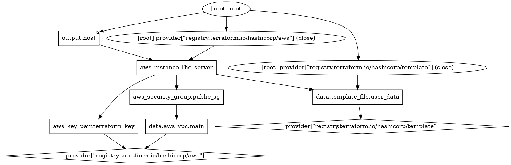

# TERRAFORM  HOL (provisioners)

- Create **apache** on EC2 instance
- SSH on instance

## Setup configuration

- Generate key pair

```bash
ssh-keygen -t rsa
chmod 400 path/keyName 
```
## Setup Terraform

```bash
terraform init
terraform plan
terraform apply
```
replace for single resource
```
terraform apply -replace="<resource>"
terraform apply -replace="aws_instance.The_server"
```
## To SSH  on instance
use the key pair generated

```bash
ssh ec2-user@IP_ADDRESS -i path/keyName 
```
### For example `ssh ec2-user@ec2-18-206-163-34.compute-1.amazonaws.com -i /root/.ssh/terraform`

To view user data on instance use 
`curl http://169.254.169.254/latest/user-data/ `


## Cleanup
```bash
terraform destroy
```
Use the following dot command to generate a png 
```
 terraform graph | dot -Tpng > output.png
```



To install dot on ubuntu
```bash
sudo apt-get install graphviz
```


